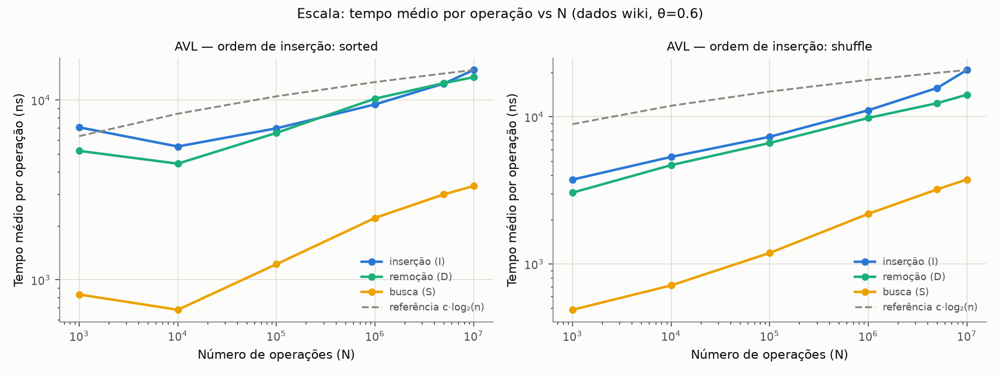
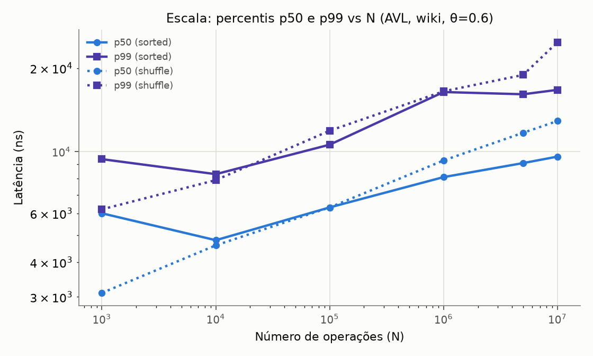
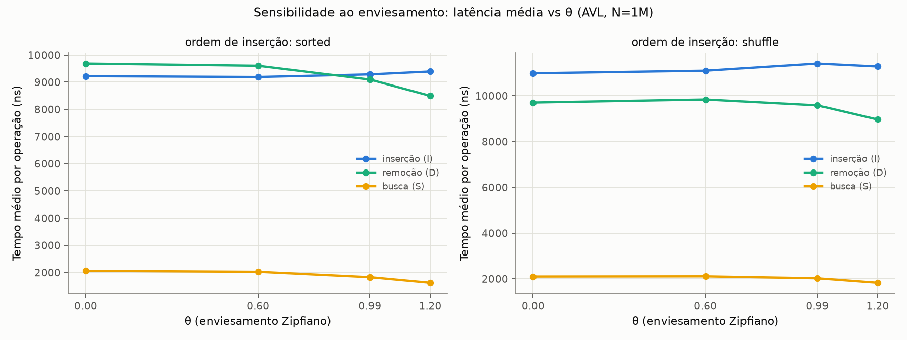
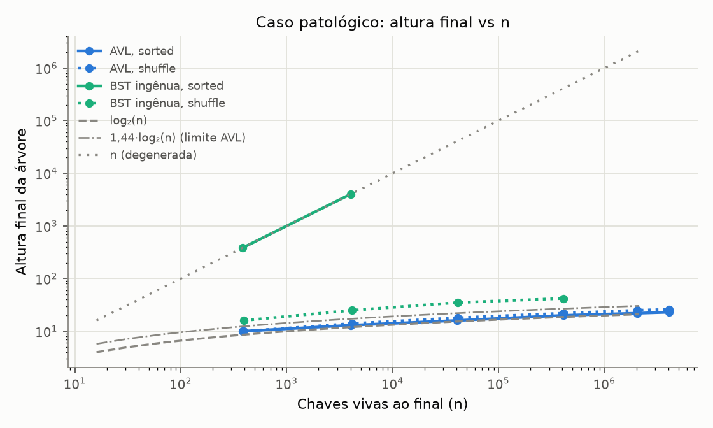
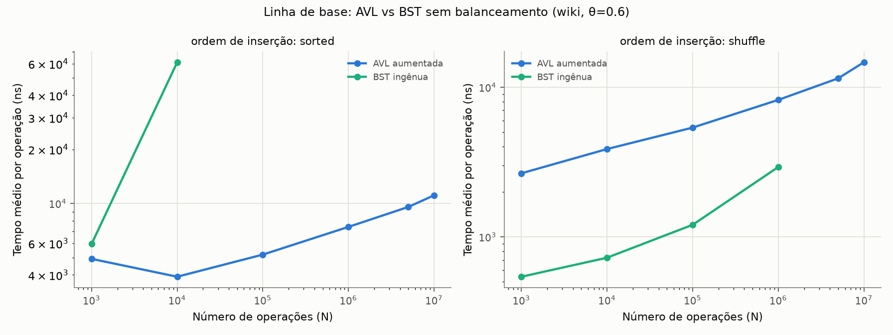

# Relatório Empírico — Árvore AVL Aumentada sob Carga Real

**Projeto Final de Estruturas de Dados — Grupo 7**

| Parâmetro do grupo | Valor |
|---|---|
| Conjunto de dados | `wiki` — timestamps de edições da Wikipédia (SOSD, `wiki_ts_200M_uint64`) |
| Enviesamento (θ) | 0.6 |
| Mix de operações (I:D:S) | 55:15:30 |
| Agregação de `range_agg` | contagem |
| Ordem de inserção | sorted |
| Seed | 7 |

---

## 1. Metodologia

### 1.1 Ambiente de medição

| Item | Valor |
|---|---|
| Processador | AMD Ryzen 5 5600GT (6 núcleos Zen 3, 16 MB L3) |
| Memória RAM | 16 GB |
| Sistema operacional | Windows 11 Home (build 26200) |
| Python | 3.14.0 (MSC v.1944, 64 bits) |
| Data da execução | 15/07/2026, 14h50–15h03 (suíte completa: ~13 min) |

### 1.2 Como as medições foram feitas

- Cada operação (`I`, `D`, `S`) do trace é cronometrada individualmente com
  `time.perf_counter_ns()`, o relógio de maior resolução disponível em Python.
  O parse do trace acontece **antes** do laço de medição, para que manipulação
  de strings não contamine as latências.
- As latências são acumuladas **separadas por tipo de operação**; reportamos
  média, p50 e p99 por operação e no agregado.
- Os traces são gerados por `gen_workload_1.py` a partir das chaves reais do
  conjunto `wiki` (θ=0.6, mix 55:15:30, seed 7), com `--max-load 2N` para
  limitar o uso de RAM. Como a seed é fixa, **todos os resultados são
  reproduzíveis** pelo docente.
- **Toda execução é conferida com o oráculo** (`gen_workload_1.py verify`);
  a coluna `oracle` do `benchmark_summary.csv` registra o resultado. As 26
  execuções desta suíte passaram sem nenhuma divergência — na maior delas
  (10M de operações, ordem sorted), 3.000.660 buscas foram conferidas.
- A estrutura de linha de base (BST sem balanceamento) tem custo O(profundidade)
  por operação e degenera para O(n) sob inserção ordenada; por isso ela foi
  limitada a N ≤ 10k (ordem sorted) e N ≤ 1M (ordem shuffle) — acima disso um
  único cenário levaria horas sem acrescentar informação nova.
- Observação sobre N: o gerador consome N **operações** com mix 55:15:30;
  o número de chaves vivas ao final é ≈ 0,41·N (ex.: 4.075.389 chaves vivas
  no cenário de 10M de operações).

### 1.3 Reprodução

```bash
# 1. Obter o dataset (1,5 GB) e salvá-lo em data/wiki_ts_200M_uint64
# 2. Rodar a suíte completa (gera traces, executa, verifica com o oráculo):
python benchmark_manager.py
# 3. Gerar os gráficos:
python scripts/generate_charts.py
```

---

## 2. Experimento 1 — Escala (tempo por operação vs N)

Medimos o tempo médio, p50 e p99 por operação variando N em quatro ordens de
grandeza: **1k, 10k, 100k, 1M, 5M e 10M operações**.





### Interpretação

- **A forma logarítmica se confirma, mas com inclinação extra.** Na ordem
  sorted (a do grupo), a busca média foi de 681 ns (N=10k) a 3.327 ns (N=10M):
  crescimento de ~4,9× enquanto n cresceu 1.000×. Uma curva O(log n) pura
  cresceria apenas ~1,8× nessa faixa (altura 13 → 23). A diferença é o custo
  **por nível** subindo com o tamanho da árvore: de ~52 ns/nível em N=10k para
  ~145 ns/nível em N=10M — ver Experimento 4 (efeito de cache).
- **Inserção e remoção custam ~4–5× a busca** (em N=10M sorted: 14,7 µs e
  13,4 µs vs 3,3 µs). A descida é a mesma O(log n); o excedente é o caminho de
  volta: recomputar `height`/`size`/`aggregate` em cada nível, checar o fator
  de balanceamento, eventualmente rotacionar, e (na inserção) alocar o objeto
  `Node`.
- **O ponto de N=1k foge da curva** (busca 829 ns > 681 ns de N=10k). Com
  poucas centenas de operações medidas, o aquecimento do interpretador e a
  resolução do timer pesam mais que a estrutura — é ruído de medição em
  amostra pequena, não um efeito da árvore.
- **p99 ≈ 1,7–2× o p50** em toda a faixa (ex.: 16,7 µs vs 9,6 µs em N=10M
  sorted). O p99 concentra os casos raros e caros: remoções de nós com dois
  filhos (que fazem uma segunda descida pelo sucessor), cascatas de rotação e
  pausas do coletor de lixo do CPython.

## 3. Experimento 2 — Sensibilidade ao enviesamento (θ)

Repetimos a carga com θ ∈ {0.0, 0.6, 0.99, 1.2} em N = 1M, nas duas ordens de
inserção.



### Interpretação

- **Busca acelera com o enviesamento: −21% de θ=0 para θ=1.2** (2.061 →
  1.620 ns, ordem sorted). Com θ alto, poucas chaves "quentes" concentram os
  acessos; o caminho raiz→nó dessas chaves é revisitado continuamente e
  permanece nos caches L1/L2 — a localidade temporal compensa a profundidade.
- **O p50 da busca cai pela metade (2.100 → 1.100 ns) enquanto o p99 fica
  estável (~4.200–4.600 ns).** É a assinatura clássica de carga Zipfiana:
  a mediana é dominada pelas chaves quentes (caminho em cache), mas a cauda
  continua pagando o custo integral das chaves frias — o enviesamento ajuda
  o caso típico, não o pior caso.
- **Remoção também acelera (−12%)**, pelo mesmo motivo na fase de descida.
  As remoções concentradas não aumentaram o custo de rebalanceamento de forma
  mensurável: as rotações são O(1) por nível e o caminho quente amortiza.
- **Inserção fica praticamente flat (+2%)** — como esperado: a ordem e o
  conjunto de chaves inseridas não dependem de θ (o enviesamento só governa
  *quais* chaves são buscadas/removidas), então o custo de inserção não tinha
  por que mudar.

## 4. Experimento 3 — Caso patológico (sorted vs shuffle)

A ordem de inserção do Grupo 7 é `sorted` — exatamente o caso patológico para
BSTs sem balanceamento. Comparamos as duas ordens nas duas estruturas.



### Interpretação

- **A BST ingênua degenera por completo:** com inserção ordenada, altura final
  = número de chaves vivas (383 em N=1k; 4.022 em N=10k) — uma corrente. Cada
  operação vira O(n): em N=10k ela ficou **15,6× mais lenta** que a AVL
  (61,1 µs vs 3,9 µs por operação, média).
- **A AVL é imune à ordem:** altura 23 com 4,08M de chaves vivas — apenas 5%
  acima do log₂(n) = 22 e bem abaixo do limite teórico 1,44·log₂(n) ≈ 32.
  O invariante de balanceamento segura a altura nas duas ordens.
- **Achado contraintuitivo: para a AVL, sorted é o caso *bom*.** A inserção
  ordenada produziu árvores mais baixas (23 vs 26 em 10M) e inserções 29%
  mais rápidas que shuffle (14,7 vs 20,8 µs). Explicação: inserindo sempre a
  maior chave, toda inserção desce pela espinha direita — um caminho curto,
  fixo e quente no cache — e as rotações se concentram nela, empacotando a
  árvore de forma quase perfeita. Já o shuffle espalha as inserções pela
  árvore inteira (sem localidade) e deixa a árvore ~13% mais alta. O caso
  "patológico" do enunciado é patológico para quem **não** balanceia; para a
  AVL, ele vira o melhor cenário — nossa evidência mais direta de que o
  rebalanceamento cumpre o que promete.
- Com shuffle, a BST ingênua fica com altura ≈ 2,3·log₂(n) (42 vs log₂ = 18,6
  em 1M) — consistente com o esperado ~2·log₂(n) de inserção aleatória — e
  seu desempenho fica competitivo (ver Experimento 5). O balanceamento se
  justifica mesmo assim: a carga real do grupo **é** ordenada, e nenhuma
  estrutura sem garantia de pior caso sobrevive a ela.

## 5. Experimento 4 — Teoria × Prática

| Operação | Limite teórico | Comportamento medido (sorted) | Divergência e explicação |
|---|---|---|---|
| `search` | O(log n) | 681 ns → 3.327 ns de 10k a 10M (4,9×; log puro daria 1,8×) | custo por nível cresce 52 → 145 ns com a árvore fora do cache |
| `insert` | O(log n) + rotações O(1) amortizadas | 5,5 µs → 14,7 µs; sempre ~4–5× a busca | caminho de volta: `_update` por nível + alocação de `Node` + recursão |
| `delete` | O(log n), até O(log n) rotações | 4,4 µs → 13,4 µs; p99 20,3 µs (o maior de todos) | caso de dois filhos: descida extra pelo sucessor + remoção recursiva |

Onde a curva real diverge da teórica, e por quê:

- **Constantes de Python dominam.** Cada nó é um objeto no heap; cada nível
  custa uma chamada recursiva, comparações via protocolo de objetos e acesso
  a atributos por dicionário. O "c" do c·log n é da ordem de centenas de ns —
  em C seria de unidades de ns. A forma da curva é a teórica; a escala é 100×.
- **Cache torna o "log n" superlinear na prática.** A árvore de 10k chaves
  vivas (~4 mil nós) cabe nos caches; a de 4M de nós não cabe nos 16 MB de L3
  do Ryzen 5600GT. A partir daí, cada nível da descida é potencialmente um
  cache miss de ~100 ns — exatamente o fator ~2,8× que medimos no custo por
  nível. É por isso que a curva medida sobe mais que a referência c·log₂(n)
  ajustada nos pontos pequenos.
- **Rotações são baratas na média, visíveis no p99.** O custo amortizado O(1)
  de rotação por inserção aparece: a média de inserção acompanha a busca a
  fator constante. Já o p99 da remoção (20,3 µs) carrega os casos de dois
  filhos e cascatas de rebalanceamento até a raiz.
- **Alocação e GC.** Inserções pagam a criação do `Node`; as pausas do GC do
  CPython aparecem como outliers que engordam o p99 (~1,7–2× o p50) mesmo em
  operações que não alocam, como a busca.

## 6. Experimento 5 — Linha de base ingênua e ponto de cruzamento



### Interpretação

- **Ordem sorted (a carga do grupo): o cruzamento acontece antes de n=383.**
  Já no menor cenário medido (N=1k, 383 chaves vivas) a AVL vence (4,9 vs
  5,9 µs), e em N=10k a vantagem é 15,6×, crescendo linearmente com n. Para
  a carga real do Grupo 7, não existe faixa em que a ingênua compense.
- **Ordem shuffle: o cruzamento não ocorre na faixa medida — a ingênua é
  2,8–4,9× mais rápida.** Com inserção aleatória a BST fica só ~2× mais
  profunda, e cada operação dela executa muito menos trabalho em Python (laço
  iterativo, sem `_update`, sem rebalanceamento, sem recursão). A vantagem da
  ingênua, porém, **encolhe com n** (4,9× em 1k → 2,8× em 1M), porque a
  profundidade 2·log₂(n) dela paga cada vez mais cache misses que a AVL, mais
  rasa. Extrapolando a tendência, o cruzamento ocorreria em n na casa das
  dezenas/centenas de milhões — mas, principalmente, essa comparação só vale
  para carga aleatória e sem adversários.
- **Síntese: o que se compra com o rebalanceamento é a garantia, não a média.**
  A ingênua é imbatível quando a ordem de chegada é aleatória e o pior caso
  não importa; basta a ordem ser desfavorável (a nossa é!) para ela colapsar
  em O(n). A AVL paga um fator constante (~3×) na carga aleatória para
  garantir O(log n) em **qualquer** carga — incluindo p99 estável.

## 7. Conclusões

- O comportamento O(log n) da AVL aumentada **se confirmou nas quatro ordens
  de grandeza**, com altura a ≤ 5% do log₂(n) mínimo e todas as 26 execuções
  aprovadas pelo oráculo transitivo.
- As divergências entre curva medida e teórica têm três causas mensuráveis,
  em ordem de importância: constantes do interpretador (~100×), efeitos de
  cache quando a árvore excede o L3 (custo por nível ~2,8×) e outliers de
  GC/rotação concentrados no p99.
- O enviesamento Zipfiano ajuda o caso típico (p50 da busca cai ~48% em
  θ=1.2) e não muda a cauda — quem dimensiona por p99 não deve contar com a
  distribuição de acessos.
- Para a carga específica do grupo (55% inserções **ordenadas**), o
  balanceamento não é otimização: é a diferença entre 3,3 µs e um custo O(n)
  que já era 15,6× pior com apenas 10k operações.

---

## Apêndice A — Dados completos das medições

Fonte: `benchmark_summary.csv`, gerado por `benchmark_manager.py` na máquina
da §1.1 (seed 7). Latências em microssegundos (µs).

### Tabela A1 — visão geral por cenário

| Experimento | Cenário | Estrutura | Ops | Ordem | θ | Oráculo | Média (µs) | p50 (µs) | p99 (µs) | Altura final | Chaves vivas |
|---|---|---|---|---|---|---|---|---|---|---|---|
| escala | wiki_1k_sorted | avl | 1000 | sorted | 0.6 | OK | 4.91 | 6.00 | 9.40 | 10 | 383 |
| escala | wiki_1k_sorted | naive | 1000 | sorted | 0.6 | OK | 5.95 | 5.00 | 15.30 | 383 | 383 |
| escala | wiki_1k_shuffle | avl | 1000 | shuffle | 0.6 | OK | 2.66 | 3.10 | 6.20 | 10 | 393 |
| escala | wiki_1k_shuffle | naive | 1000 | shuffle | 0.6 | OK | 0.54 | 0.50 | 1.50 | 16 | 393 |
| escala | wiki_10k_sorted | avl | 10000 | sorted | 0.6 | OK | 3.91 | 4.80 | 8.30 | 13 | 4022 |
| escala | wiki_10k_sorted | naive | 10000 | sorted | 0.6 | OK | 61.13 | 50.80 | 157.90 | 4022 | 4022 |
| escala | wiki_10k_shuffle | avl | 10000 | shuffle | 0.6 | OK | 3.86 | 4.60 | 7.90 | 14 | 4130 |
| escala | wiki_10k_shuffle | naive | 10000 | shuffle | 0.6 | OK | 0.72 | 0.70 | 1.70 | 25 | 4130 |
| escala | wiki_100k_sorted | avl | 100000 | sorted | 0.6 | OK | 5.19 | 6.30 | 10.60 | 16 | 40698 |
| escala | wiki_100k_shuffle | avl | 100000 | shuffle | 0.6 | OK | 5.37 | 6.30 | 11.90 | 18 | 41064 |
| escala | wiki_100k_shuffle | naive | 100000 | shuffle | 0.6 | OK | 1.20 | 1.00 | 2.90 | 35 | 41064 |
| escala | wiki_1M_sorted | avl | 1000000 | sorted | 0.6 | OK | 7.40 | 8.10 | 16.40 | 20 | 407757 |
| escala | wiki_1M_shuffle | avl | 1000000 | shuffle | 0.6 | OK | 8.23 | 9.30 | 16.50 | 22 | 407265 |
| escala | wiki_1M_shuffle | naive | 1000000 | shuffle | 0.6 | OK | 2.93 | 2.20 | 7.40 | 42 | 407265 |
| escala | wiki_5M_sorted | avl | 5000000 | sorted | 0.6 | OK | 9.56 | 9.10 | 16.10 | 22 | 2038165 |
| escala | wiki_5M_shuffle | avl | 5000000 | shuffle | 0.6 | OK | 11.47 | 11.70 | 18.90 | 25 | 2036332 |
| escala | wiki_10M_sorted | avl | 10000000 | sorted | 0.6 | OK | 11.10 | 9.60 | 16.70 | 23 | 4075389 |
| escala | wiki_10M_shuffle | avl | 10000000 | shuffle | 0.6 | OK | 14.69 | 12.90 | 24.80 | 26 | 4074567 |
| theta | wiki_1M_sorted_theta0_0 | avl | 1000000 | sorted | 0.0 | OK | 7.15 | 8.00 | 15.10 | 20 | 407757 |
| theta | wiki_1M_shuffle_theta0_0 | avl | 1000000 | shuffle | 0.0 | OK | 8.13 | 9.00 | 17.80 | 22 | 407265 |
| theta | wiki_1M_sorted_theta0_6 | avl | 1000000 | sorted | 0.6 | OK | 7.11 | 8.00 | 15.00 | 20 | 407757 |
| theta | wiki_1M_shuffle_theta0_6 | avl | 1000000 | shuffle | 0.6 | OK | 8.21 | 9.00 | 18.00 | 22 | 407265 |
| theta | wiki_1M_sorted_theta0_99 | avl | 1000000 | sorted | 0.99 | OK | 7.02 | 7.90 | 15.20 | 20 | 407757 |
| theta | wiki_1M_shuffle_theta0_99 | avl | 1000000 | shuffle | 0.99 | OK | 8.32 | 8.90 | 18.70 | 22 | 407265 |
| theta | wiki_1M_sorted_theta1_2 | avl | 1000000 | sorted | 1.2 | OK | 6.93 | 7.80 | 14.80 | 20 | 407757 |
| theta | wiki_1M_shuffle_theta1_2 | avl | 1000000 | shuffle | 1.2 | OK | 8.10 | 8.80 | 18.30 | 22 | 407265 |

### Tabela A2 — latências por tipo de operação (µs)

| Cenário | Estrutura | I média | I p50 | I p99 | D média | D p50 | D p99 | S média | S p50 | S p99 |
|---|---|---|---|---|---|---|---|---|---|---|
| wiki_1k_sorted | avl | 7.06 | 7.30 | 10.30 | 5.22 | 5.40 | 7.50 | 0.83 | 0.80 | 2.60 |
| wiki_1k_sorted | naive | 8.11 | 8.00 | 15.40 | 4.07 | 2.90 | 14.60 | 3.05 | 2.10 | 12.80 |
| wiki_1k_shuffle | avl | 3.74 | 3.60 | 7.40 | 3.05 | 3.10 | 5.00 | 0.49 | 0.50 | 1.00 |
| wiki_1k_shuffle | naive | 0.59 | 0.60 | 1.60 | 0.61 | 0.60 | 1.50 | 0.42 | 0.40 | 1.40 |
| wiki_10k_sorted | avl | 5.52 | 5.60 | 9.00 | 4.43 | 4.40 | 7.80 | 0.68 | 0.70 | 1.30 |
| wiki_10k_sorted | naive | 81.70 | 81.20 | 160.10 | 40.85 | 29.60 | 145.00 | 33.85 | 23.10 | 131.80 |
| wiki_10k_shuffle | avl | 5.34 | 5.10 | 8.40 | 4.69 | 4.70 | 6.90 | 0.71 | 0.70 | 1.20 |
| wiki_10k_shuffle | naive | 0.80 | 0.70 | 1.80 | 0.75 | 0.70 | 1.70 | 0.57 | 0.60 | 1.10 |
| wiki_100k_sorted | avl | 6.97 | 6.80 | 11.10 | 6.57 | 6.60 | 11.20 | 1.22 | 1.10 | 2.60 |
| wiki_100k_shuffle | avl | 7.32 | 7.10 | 12.80 | 6.64 | 6.60 | 11.90 | 1.19 | 1.10 | 2.60 |
| wiki_100k_shuffle | naive | 1.31 | 1.10 | 3.00 | 1.27 | 1.20 | 3.10 | 0.98 | 0.90 | 2.50 |
| wiki_1M_sorted | avl | 9.46 | 8.40 | 15.60 | 10.19 | 9.70 | 20.50 | 2.21 | 2.10 | 5.30 |
| wiki_1M_shuffle | avl | 11.09 | 10.30 | 17.60 | 9.83 | 9.80 | 16.40 | 2.19 | 2.20 | 4.20 |
| wiki_1M_shuffle | naive | 3.38 | 2.20 | 7.60 | 2.71 | 2.40 | 7.80 | 2.21 | 1.90 | 6.70 |
| wiki_5M_sorted | avl | 12.36 | 9.30 | 15.40 | 12.43 | 12.50 | 20.30 | 2.99 | 3.10 | 5.50 |
| wiki_5M_shuffle | avl | 15.72 | 12.90 | 20.20 | 12.39 | 12.40 | 19.30 | 3.21 | 3.20 | 5.60 |
| wiki_10M_sorted | avl | 14.70 | 10.00 | 14.60 | 13.41 | 13.60 | 19.90 | 3.33 | 3.40 | 5.80 |
| wiki_10M_shuffle | avl | 20.81 | 14.30 | 25.70 | 14.14 | 13.80 | 24.50 | 3.75 | 3.70 | 7.10 |
| wiki_1M_sorted_theta0_0 | avl | 9.22 | 8.30 | 14.80 | 9.68 | 9.40 | 17.50 | 2.06 | 2.10 | 4.20 |
| wiki_1M_shuffle_theta0_0 | avl | 10.98 | 10.00 | 18.60 | 9.71 | 9.50 | 17.30 | 2.10 | 2.10 | 4.20 |
| wiki_1M_sorted_theta0_6 | avl | 9.19 | 8.30 | 14.70 | 9.60 | 9.40 | 17.30 | 2.03 | 2.00 | 4.20 |
| wiki_1M_shuffle_theta0_6 | avl | 11.10 | 10.10 | 18.80 | 9.84 | 9.60 | 17.50 | 2.11 | 2.10 | 4.20 |
| wiki_1M_sorted_theta0_99 | avl | 9.29 | 8.30 | 15.10 | 9.10 | 8.60 | 17.50 | 1.83 | 1.70 | 4.30 |
| wiki_1M_shuffle_theta0_99 | avl | 11.41 | 10.20 | 19.50 | 9.58 | 9.20 | 17.80 | 2.02 | 2.00 | 4.30 |
| wiki_1M_sorted_theta1_2 | avl | 9.39 | 8.30 | 14.90 | 8.50 | 7.60 | 17.50 | 1.62 | 1.10 | 4.60 |
| wiki_1M_shuffle_theta1_2 | avl | 11.28 | 10.20 | 19.20 | 8.96 | 8.40 | 16.90 | 1.83 | 1.60 | 4.20 |

---

*Todos os gráficos deste relatório foram gerados a partir de medições
executadas na máquina identificada na §1.1, pelo script
`scripts/generate_charts.py`, a partir dos resultados brutos em
`data/outputs/` (verificados pelo oráculo). Dados brutos consolidados:
`benchmark_summary.csv`.*
